# Deformation Field Correction

Correct **negative Jacobian determinants** (folding) in 2D and 3D displacement fields produced by image registration. Three correction methods are provided — a fast heuristic, a full-grid constrained optimizer, and an iterative windowed optimizer — all ensuring the corrected field stays as close as possible to the original while eliminating folding.

## Table of Contents

- [Background](#background)
- [Problem Formulation](#problem-formulation)
- [Jacobian Determinant](#jacobian-determinant)
- [Correction Methods](#correction-methods)
  - [Heuristic (NMVF)](#1-heuristic-neighborhood-mean-vector-filter)
  - [Full-Grid SLSQP](#2-full-grid-slsqp)
  - [Iterative SLSQP](#3-iterative-slsqp)
  - [Hybrid Parallel](#hybrid-parallel-variant)
- [Constraints](#constraints)
   - [Why Positive Jacobian Is Not Global Injectivity](#why-positive-jacobian-is-not-global-injectivity)
   - [Optional: Injectivity — Axis-Aligned and Anti-Diagonal Monotonicity](#optional-injectivity-monotonicity)
- [Convergence](#convergence)
  - [Constraint Convergence](#constraint-convergence)
- [3D Extension](#3d-extension)
- [Data Conventions](#data-conventions)
- [Project Structure](#project-structure)
- [Test Cases](#test-cases)
- [Installation](#installation)
- [Usage](#usage)

---

## Background

Deformable image registration computes a displacement field $\phi$ that maps each pixel in a fixed image to its corresponding location in a moving image. When the Jacobian determinant of $\phi$ becomes negative at a pixel, the mapping **folds** — meaning the deformed grid crosses over itself both locally and globally, creating a physically implausible transformation.

This project corrects such folding by minimally adjusting the displacement field so that $J_{\det}(\phi) > 0$ everywhere, while keeping the corrected field as close to the original as possible. This is posed as a constrained optimization problem, which can be applied as a post-processing step to any existing registration pipeline.

## Problem Formulation

Given an input displacement field $\phi_{\text{init}}$ with regions of negative Jacobian determinant, find a corrected field $\phi^*$ that solves:

$$\phi^* = \arg\min_\phi \|\phi - \phi_{\text{init}}\|_2$$

subject to:

$$J_{\det}(\phi)(x, y) \geq \tau \quad \forall \; (x, y) \in \Omega$$

where $\tau = 0.01$ is the Jacobian determinant threshold (strictly positive) and $\Omega$ is the spatial domain.

### Breaking it down

**The objective** — $\|\phi - \phi_{\text{init}}\|_2$:

- $\phi$ is the displacement field we are searching for (the corrected output).
- $\phi_{\text{init}}$ is the original displacement field that came out of registration — the one with folding.
- $\|\cdot\|_2$ is the L2 (Euclidean) norm: the straight-line distance between two vectors. Concretely, $\|\phi - \phi_{\text{init}}\|_2 = \sqrt{\sum_i (\phi_i - \phi_{\text{init},i})^2}$, summing over every displacement component at every pixel.
- **Why L2?** We want the corrected field to stay as close as possible to the original. The L2 norm penalizes large deviations more than many small ones, so it favors spreading tiny adjustments across the field rather than making one big change somewhere.

**The constraint** — $J_{\det}(\phi)(x, y) \geq \tau$:

- $J_{\det}(\phi)(x, y)$ is the Jacobian determinant of the displacement field at pixel $(x, y)$. It measures how much the local area around that pixel stretches or shrinks (explained in the next section).
- $\geq \tau$ means the Jacobian determinant must be at least $\tau = 0.01$ — strictly positive.
- $\forall \; (x, y) \in \Omega$ means this must hold at **every** pixel in the domain.
- **Why not $\geq 0$?** A threshold of exactly zero would leave the optimizer balanced on a knife-edge — any numerical rounding could push a pixel back to negative. The small positive margin ($0.01$) gives a safety buffer.

**$\arg\min$:**

- $\arg\min_\phi$ means "find the $\phi$ that makes the expression as small as possible." So the full statement reads: _find the displacement field $\phi$ that is closest to the original, subject to no pixel having a Jacobian determinant below 0.01._

## Jacobian Determinant

### 2D Computation

For a displacement field with components $(u_x, u_y)$, the deformation gradient is:

$$F = I + \nabla u = \begin{pmatrix} 1 + \frac{\partial u_x}{\partial x} & \frac{\partial u_x}{\partial y} \[4pt] \frac{\partial u_y}{\partial x} & 1 + \frac{\partial u_y}{\partial y} \end{pmatrix}$$

The Jacobian determinant is the determinant of $F$:

$$J_{\det} = \left(1 + \frac{\partial u_x}{\partial x}\right)\left(1 + \frac{\partial u_y}{\partial y}\right) - \frac{\partial u_x}{\partial y} \cdot \frac{\partial u_y}{\partial x}$$

Spatial derivatives are computed via `np.gradient` (central differences at interior pixels, one-sided at boundaries). This matches SimpleITK for interior pixels while avoiding the ~3 ms/call overhead that made SLSQP numerical gradients infeasible.

#### What each piece means

**$u_x$ and $u_y$** are the horizontal and vertical components of the displacement at each pixel. They say "move this pixel _this far_ in x and _this far_ in y."

**$\frac{\partial u_x}{\partial x}$** is the rate of change of the x-displacement as you step one pixel to the right. If your neighbor's x-displacement is much larger than yours, this derivative is large — meaning the spacing between deformed pixels is stretching in the x-direction.

**The $1 +$ terms.** With zero displacement, adjacent pixels are exactly 1 unit apart (pixel spacing). The deformation gradient captures the _total_ spacing after deformation: original spacing ($1$) plus the change from displacement ($\frac{\partial u}{\partial \cdot}$). So $1 + \frac{\partial u_x}{\partial x}$ is the deformed x-spacing in the x-direction.

**Why a $2 \times 2$ matrix?** Each pixel's displacement has 2 components ($u_x, u_y$), and each can vary along 2 directions ($x, y$). The $2 \times 2$ deformation gradient $F$ captures all four combinations: how x-displacement changes in x, how x-displacement changes in y, how y-displacement changes in x, and how y-displacement changes in y.

**The determinant formula** — $(1 + \frac{\partial u_x}{\partial x})(1 + \frac{\partial u_y}{\partial y}) - \frac{\partial u_x}{\partial y} \cdot \frac{\partial u_y}{\partial x}$:

- The first product is the "diagonal" contribution — how much the grid stretches independently along x and y. If both are positive, the grid is locally expanding or compressing but not rotating.
- The second product is the "off-diagonal" or shear contribution — how much each displacement component leans into the other axis. This captures rotation and skew.
- Subtracting the shear from the diagonal gives the **signed area** of the deformed unit cell. Positive means the cell kept its orientation (no fold). Negative means it flipped — the grid crossed over itself.

**Intuition:** Think of a small square of paper. Stretch it, compress it, or rotate it — $J_{\det}$ stays positive. But fold it over (flip it inside-out) and $J_{\det}$ goes negative. That fold is exactly what we need to fix.

#### Interpreting the value

- $J_{\det} = 1$: no deformation (identity)
- $J_{\det} > 1$: local expansion
- $0 < J_{\det} < 1$: local compression
- $J_{\det} \leq 0$: **folding** (invalid, needs correction)

### 3D Computation

The 3D deformation gradient $F \in \mathbb{R}^{3 \times 3}$. Its determinant is computed via cofactor expansion along the first row:

$$\det(F) = a_{11}(a_{22}a_{33} - a_{23}a_{32}) - a_{12}(a_{21}a_{33} - a_{23}a_{31}) + a_{13}(a_{21}a_{32} - a_{22}a_{31})$$

where $a_{ij} = \delta_{ij} + \frac{\partial u_j}{\partial x_i}$, computed from 9 partial derivatives via `np.gradient`.

## Correction Methods

### 1. Heuristic (Neighborhood Mean Vector Filter)

**Notebook:** `heuristic-neg-jacobian.ipynb`

The fastest but least accurate method. Replaces displacement vectors in the neighborhood of negative-Jdet pixels with the local mean:

1. Compute Jacobian determinant over the entire field
2. Find all pixels where $J_{\det} \leq 0$
3. For each negative pixel at $(y, x)$:
   - Extract the 3×3 neighborhood centered on $(y, x)$
   - Compute the mean displacement vector (excluding the center)
   - Replace displacement vectors in the 3×3 neighborhood with this mean
4. Repeat until no negative Jacobian determinants remain (or max iterations)

**Tradeoff:** Fastest convergence, but highest L2 error (largest deviation from original field). No optimality guarantee.

### 2. Full-Grid SLSQP

**Entry point:** `_full_grid_step()` in `dvfopt/core/solver.py`

Optimizes the entire displacement field simultaneously via Sequential Least Squares Programming (SLSQP):

1. Flatten the full $(2, H, W)$ displacement field into a single vector $\phi$
2. Run `scipy.optimize.minimize(method='SLSQP')` with:
   - **Objective:** $\min \|\phi - \phi_{\text{init}}\|_2$
   - **Constraint:** $J_{\det}(\phi)(x, y) \geq 0.01$ for all interior pixels
3. Reshape the result back to $(2, H, W)$

**Tradeoff:** Lowest L2 error (globally optimal), but slowest — runtime scales quadratically with grid size since all pixels are optimized together.

### 3. Iterative SLSQP

**Entry point:** `iterative_serial()` in `dvfopt/core/iterative.py`

The primary method. Instead of optimizing the full grid, it repeatedly identifies the worst folding region and corrects it with a small local optimization:

```
1. Compute Jacobian determinant over full grid
2. While any interior pixel has J_det <= threshold - ε:
   a. Find the interior pixel with the lowest J_det
   b. Identify the connected component of negative-J_det pixels
      around it (8-connectivity)
   c. Compute the bounding box of that component,
      expand by +1 pixel on all sides (minimum 3×3)
   d. Extract the sub-window of displacement vectors
   e. Freeze edge pixels of the window to their initial values
   f. Run SLSQP on the sub-window:
      - Objective: minimize L2 distance from initial
      - Constraint: J_det >= 0.01 at all interior window pixels
      - Linear constraint: edge pixels remain fixed
   g. Write corrected sub-window back into the full field
   h. If window didn't converge, grow by +2 pixels and retry
   i. If window reached full grid size, run full-grid fallback
3. Return corrected field
```

**Key design choices:**

- **Adaptive window sizing:** The bounding-box approach ensures each window is only as large as needed, keeping the per-step optimization fast.
- **Frozen edges:** Edge pixels of each sub-window are constrained to their initial values. This prevents "pushing" negativity outside the window. The +1 positive-border expansion ensures frozen edges are feasible.
- **Edge feasibility check:** Before running the optimizer, the algorithm verifies that frozen edge pixels have positive Jacobian determinants. If not, it grows the window (by +2 pixels each dimension) and retries.
- **Full-grid fallback:** For non-square grids where the window has grown to grid size, falls back to full-grid SLSQP as a last resort.

**Tradeoff:** Near-optimal L2 error with substantially faster runtime than full-grid SLSQP, especially for fields with sparse folding regions.

### Hybrid Parallel Variant

**Entry point:** `iterative_parallel()` in `dvfopt/core/parallel.py`

Extends the iterative method to process multiple non-overlapping windows simultaneously:

1. Identify **all** negative-Jdet pixels, sorted worst-first
2. Assign each an adaptive window size (bounding box + border)
3. **Greedy batch selection:** Pick the worst pixel's window, then greedily add windows that don't overlap any selected window
4. **Execute batch:**
   - Single window → run serially (avoids process-spawn overhead)
   - Multiple windows → dispatch to `ProcessPoolExecutor` in parallel
5. Apply all results, recompute Jacobian, repeat
6. **Escalation:** If a batch produces no improvement, force all windows to grow by +2 globally, increasing the chance of convergence at the cost of serialization

## Constraints

### Primary: Jacobian Determinant

The core constraint ensuring no folding:

$$J_{\det}(\phi)(x, y) \geq 0.01 \quad \forall \; \text{interior pixels}$$

Implemented as a `NonlinearConstraint` in SciPy's SLSQP. The threshold is strictly positive (not $\geq 0$) to provide a margin against numerical drift.

**Why only interior pixels?** Edge pixels of the grid have one-sided finite differences (only one neighbor instead of two), making their Jacobian determinant less reliable. Constraining them would force the optimizer to satisfy a less accurate measurement. Interior pixels use symmetric central differences, giving a trustworthy value to constrain.

**Why nonlinear?** The Jacobian determinant involves _products_ of displacement components (the $\frac{\partial u_x}{\partial x} \cdot \frac{\partial u_y}{\partial y}$ term), so it is a nonlinear function of the optimization variables. SLSQP handles this by locally linearizing the constraint at each iteration step.

**Example result (Jacobian-only):** The 20×20 crossing case (`03d_20x20_crossing`) corrected with only the Jacobian constraint. Left shows the initial field with 30 negative-Jdet pixels (green contours), right shows the corrected field with all folds eliminated:

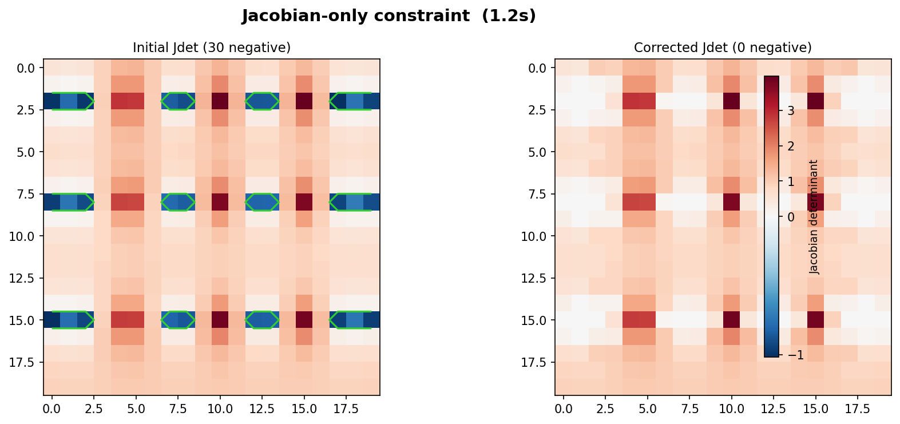

### Why Positive Jacobian Is Not Global Injectivity

The Jacobian determinant constraint is a **local** condition:

$$\det(DF(x)) > 0$$

means the map is locally orientation-preserving and locally invertible around each point $x$. But global injectivity requires:

$$F(x_1) \neq F(x_2) \quad \forall x_1 \neq x_2$$

which is a **global** one-to-one property over the whole domain. A map can satisfy $\det(DF)>0$ everywhere and still overlap distant regions (many-to-one globally).

In practical terms for displacement correction: Jacobian positivity removes local flips/folds, but by itself does not prevent non-local self-overlap. This is exactly why optional global-geometric constraints (shoelace/injectivity) are useful.

#### The "double-flip" gap

A subtler problem exists even within a single cell. The determinant formula is:

$$J_{\det} = \left(1 + \frac{\partial u_y}{\partial y}\right)\left(1 + \frac{\partial u_x}{\partial x}\right) - \frac{\partial u_y}{\partial x} \cdot \frac{\partial u_x}{\partial y}$$

The determinant can be **positive even if both diagonal terms are individually negative**:

$$\left(1 + \frac{\partial u_y}{\partial y}\right) = -0.5, \quad \left(1 + \frac{\partial u_x}{\partial x}\right) = -0.8 \quad \Rightarrow \quad J_{\det} = 0.4 + \text{small shear}$$

This is a "double-flip": the cell is inverted in both $y$ and $x$ simultaneously. The determinant is positive because $(-a)(-b) = ab > 0$, but the geometry is wrong — corner positions are swapped in both directions. An optimizer minimizing L2 error subject only to $J_{\det} \geq \tau$ will happily produce this as a valid solution, because it satisfies the constraint while requiring less movement than a proper correction.

The monotonicity constraint blocks this directly: requiring $1 + \partial u_x/\partial x \geq \tau_{\text{inj}}$ and $1 + \partial u_y/\partial y \geq \tau_{\text{inj}}$ individually means neither diagonal term can go negative, regardless of the other. This is why the injectivity constraint produces geometrically correct results even in cases where the Jdet constraint alone would converge to a degenerate configuration.

**Visual example (positive Jacobian, not injective):**

Consider

$$F(x, y) = (e^x \cos y,\; e^x \sin y), \quad (x, y) \in [0,1] \times [0, 2\pi].$$

Its Jacobian determinant is

$$\det(DF) = e^{2x} > 0,$$

yet $F(x,0)=F(x,2\pi)$ for all $x$, so two different points map to the same location (non-injective globally).

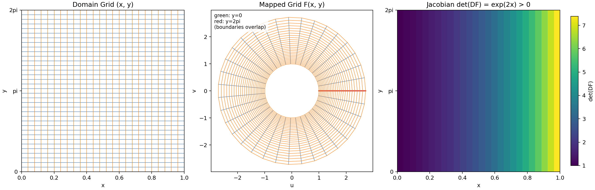

In the middle panel, the green and red boundary curves (domain rows $y=0$ and $y=2\pi$) overlap after mapping, even though the right panel shows strictly positive Jacobian values everywhere.

**Computational example (reproducible):**

```python
import numpy as np

nx, ny = 81, 121
x = np.linspace(0.0, 1.0, nx)
y = np.linspace(0.0, 2*np.pi, ny)
X, Y = np.meshgrid(x, y, indexing='xy')

U = np.exp(X) * np.cos(Y)
V = np.exp(X) * np.sin(Y)
J = np.exp(2 * X)  # det(DF)

# Non-injectivity witness: top and bottom boundaries coincide
boundary_diff = np.sqrt((U[0] - U[-1])**2 + (V[0] - V[-1])**2)

print(f"min(detDF)={J.min():.6f}")
print(f"max(detDF)={J.max():.6f}")
print(f"max ||F(x,0)-F(x,2pi)|| = {boundary_diff.max():.3e}")
print(f"overlapping boundary pairs (<1e-12): {(boundary_diff < 1e-12).sum()} / {nx}")
```

Expected output:

```text
min(detDF)=1.000000
max(detDF)=7.389056
max ||F(x,0)-F(x,2pi)|| = 6.658e-16
overlapping boundary pairs (<1e-12): 81 / 81
```

So every sampled point has positive local Jacobian, while all paired boundary points overlap to machine precision.

### Frozen Edges (Linear)

Edge pixels of each optimization window are fixed:

$$\phi_k = \phi_{k}^{\text{init}} \quad \forall \; k \in \text{edge indices}$$

Implemented as a `LinearConstraint` with a selection matrix $A$ that picks edge pixel entries from the flattened $\phi$ vector.

**What this means in practice:** When we extract a small sub-window from the full field, the outermost ring of pixels in that window is "frozen" — the optimizer is not allowed to change them. Only the interior of the window is free to move.

**Why freeze edges?** Without this, the optimizer could "solve" a local folding problem by pushing the bad displacement outward — making the window look clean while creating a new fold just outside it. Freezing the border forces the correction to be self-contained: the fix must happen _within_ the interior of the window.

**Why linear?** Each frozen-edge constraint is just "this variable equals this constant" — that is a linear equation. Linear constraints are cheap for the optimizer to enforce (no iteration needed), and they never cause convergence issues.

### Optional: Shoelace Area

Cell-based fold detection via the shoelace formula for signed area of each deformed quadrilateral cell:

$$A_{\text{cell}} = \frac{1}{2}\left|(x_0 y_1 - x_1 y_0) + (x_1 y_2 - x_2 y_1) + (x_2 y_3 - x_3 y_2) + (x_3 y_0 - x_0 y_3)\right|$$

where $(x_0, y_0), \ldots, (x_3, y_3)$ are the deformed quad vertices (TL, TR, BR, BL). Positive signed area means no geometric fold. Enabled via `enforce_shoelace=True`.

**How this differs from the Jacobian constraint:** The Jacobian determinant is computed _per pixel_ using finite-difference derivatives — it is a continuous, differential measure. The shoelace area is computed _per cell_ (the quadrilateral formed by four neighboring pixels) using exact vertex positions — it is a discrete, geometric measure. A cell can have positive Jacobian at all four corners but still be geometrically folded if the quad self-intersects (a "bowtie" shape). The shoelace constraint catches these cases.

**The shoelace formula itself:** Imagine walking around the four corners of the deformed cell in order (TL → TR → BR → BL). At each step, compute the cross product of consecutive vertex positions. Sum them up and divide by 2 — you get the signed area of the polygon. If the polygon is traced counterclockwise, the area is positive. If the quad folds over and you end up tracing clockwise, the area goes negative.

**Example result (Jacobian + Shoelace):** Top row shows Jacobian determinant before/after; bottom row shows the shoelace cell areas. The initial field has 30 negative-Jdet pixels and 72 negative-area cells. After correction, both metrics are fully positive:

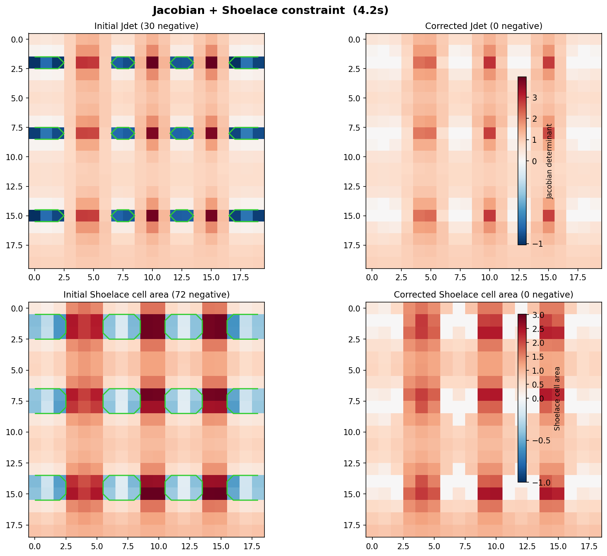

### Optional: Injectivity (Monotonicity)

Enabled via `enforce_injectivity=True`. Enforces four monotonicity conditions that together guarantee every deformed quad cell is **convex** with positive orientation — a discrete sufficient condition for global mesh injectivity.

#### Axis-aligned monotonicity (horizontal and vertical)

$$1 + u_x[i,\, j+1] - u_x[i,\, j] \;\geq\; \tau_{\text{inj}} \quad \text{(horizontal — same row)}$$
$$1 + u_y[i+1,\, j] - u_y[i,\, j] \;\geq\; \tau_{\text{inj}} \quad \text{(vertical — same column)}$$

On the original grid, adjacent pixels are 1 unit apart. After deformation, the gap between pixel $(i,j)$ and its right neighbor $(i, j+1)$ is $1 + u_x[i,j+1] - u_x[i,j]$. Requiring this to be positive keeps the neighbors in the same left-to-right order, preventing row crossings. The vertical condition does the same for columns.

#### Anti-diagonal monotonicity (per quad cell)

Axis-aligned monotonicity alone is **not sufficient** for global mesh injectivity. It constrains x-ordering within each row and y-ordering within each column independently, but it does not prevent cells from *different rows* converging into the same region under large shear — a cross-row pinch-point.

To fix this, two additional **anti-diagonal** conditions are enforced for each quad cell $(r, c)$ with corners TL, TR, BR, BL:

$$1 + u_x[r,\, c+1] - u_x[r+1,\, c] \;\geq\; \tau_{\text{inj}} \quad \text{(TR.x > BL.x)}$$
$$1 + u_y[r+1,\, c] - u_y[r,\, c+1] \;\geq\; \tau_{\text{inj}} \quad \text{(BL.y > TR.y)}$$

Reading the first condition: `TR.x = (c+1) + u_x[r, c+1]` and `BL.x = c + u_x[r+1, c]`, so `TR.x - BL.x = 1 + u_x[r,c+1] - u_x[r+1,c]`. Requiring this to be positive means the top-right corner of each deformed cell is always to the right of the bottom-left corner, keeping the quad from collapsing into a non-convex shape. Together, all four conditions guarantee each cell is a convex quadrilateral with the correct orientation.

The anti-diagonal constraints also cover **sub-window boundary-adjacent cells** — cells where one vertex is a frozen boundary pixel and one vertex is a free interior pixel. Only cells where *both* vertices are frozen are excluded (two corner cells per sub-window), since those cannot be adjusted by the optimizer.

#### The `injectivity_threshold` parameter

The injectivity constraints use a separate lower bound $\tau_{\text{inj}}$ (controlled by `injectivity_threshold`) that can be set independently of the Jdet threshold $\tau$:

```python
phi_corr = iterative_serial(
    deformation,
    enforce_injectivity=True,
    injectivity_threshold=0.3,   # vertex-separation margin
    threshold=0.01,              # Jdet lower bound (unchanged)
)
```

**Why a separate threshold?** The Jdet threshold $\tau = 0.01$ is an engineering margin against numerical drift — it just needs to be small and positive. The injectivity threshold $\tau_{\text{inj}}$ controls the *minimum vertex separation* in deformed space. Each h/v/anti-diagonal condition requires adjacent deformed coordinates to be at least $\tau_{\text{inj}}$ apart. On a W-column grid, this guarantees the total deformed span across the row is at least $(W-1) \cdot \tau_{\text{inj}}$ units. With $\tau_{\text{inj}} = 0.01$, this margin is negligible and distant rows can still pinch toward the same region. Increasing $\tau_{\text{inj}}$ forces more separation and prevents distant cells from overlapping under large shear. **Recommended starting value: `injectivity_threshold=0.3`** for fields with large global displacement.

When `injectivity_threshold=None` (default), it falls back to the value of `threshold`.

**Why "sufficient but not necessary" for global injectivity?** All four conditions together prevent any deformed cell from becoming non-convex, which is the primary failure mode for grid self-intersection. However, they are local per-cell conditions — they do not formally prevent two cells from very distant parts of the grid from coincidentally occupying the same region under extreme global shear. The `injectivity_threshold` margin addresses this in practice. For a strict geometric ground-truth test, use the quad self-intersection check in `notebooks/test-global-folding.ipynb`.

**Example result (Jacobian + Injectivity):** Top row shows Jacobian determinant before/after; bottom row shows the per-pixel worst monotonicity diff. Initially 48 pixels violate monotonicity (more than the 30 negative-Jdet pixels, since monotonicity is stricter). After correction, all diffs are positive:

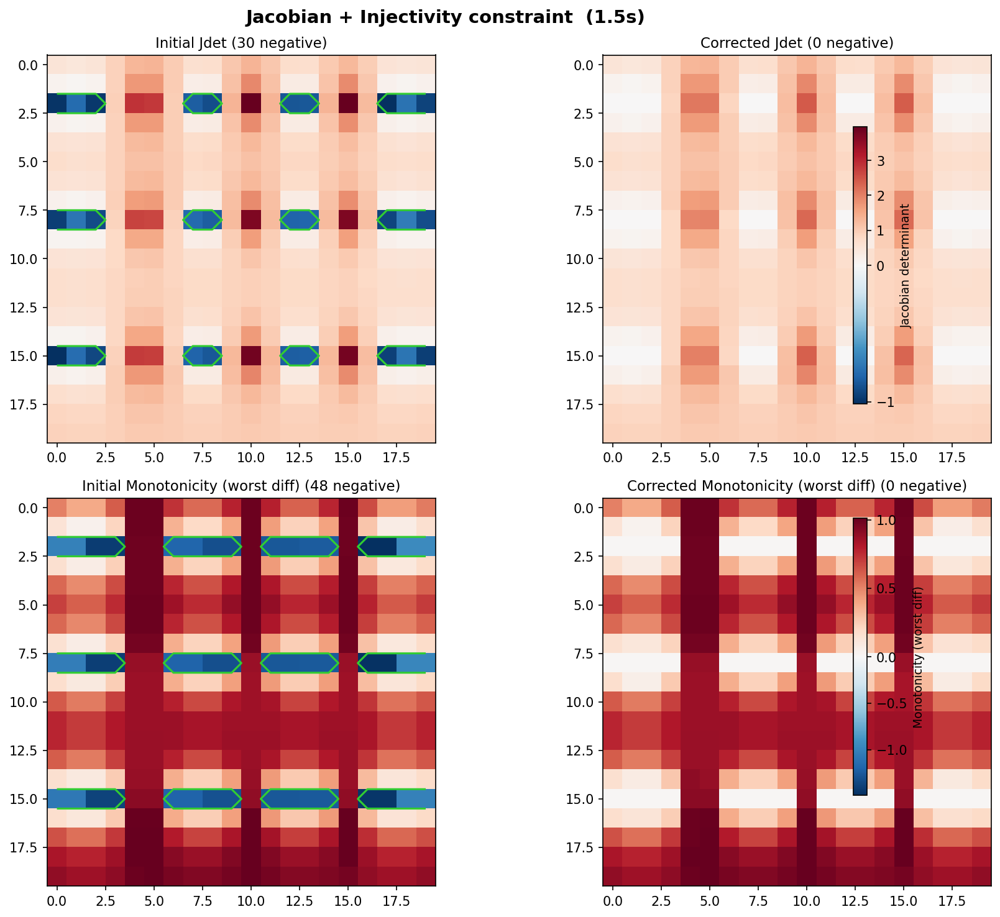

### Constraint Comparison

All constraint configurations applied to the same test case (`03d_20x20_crossing`, 24 crossing correspondences on a 20×20 grid):

| Constraints | Neg Jdet | Neg Shoelace | Mono viol. | Self-intersect | L2 Error | Time |
|------------|---------|-------------|---------|---------|---------|------|
| Jacobian only | 30 → 0 | — | — | possible | 7.53 | 1.2s |
| + Shoelace | 30 → 0 | 72 → 0 | — | possible | 6.91 | 4.2s |
| + Injectivity | 30 → 0 | — | 48 → 0 | none† | 7.56 | 1.5s |
| All three | 30 → 0 | 72 → 0 | 48 → 0 | none† | 7.56 | 3.8s |

†With `injectivity_threshold=0.3`. See the [Injectivity](#optional-injectivity-monotonicity) section for details.

With all constraints active, every metric is satisfied simultaneously. The L2 error varies because each constraint configuration steers the optimizer to a different feasible region:

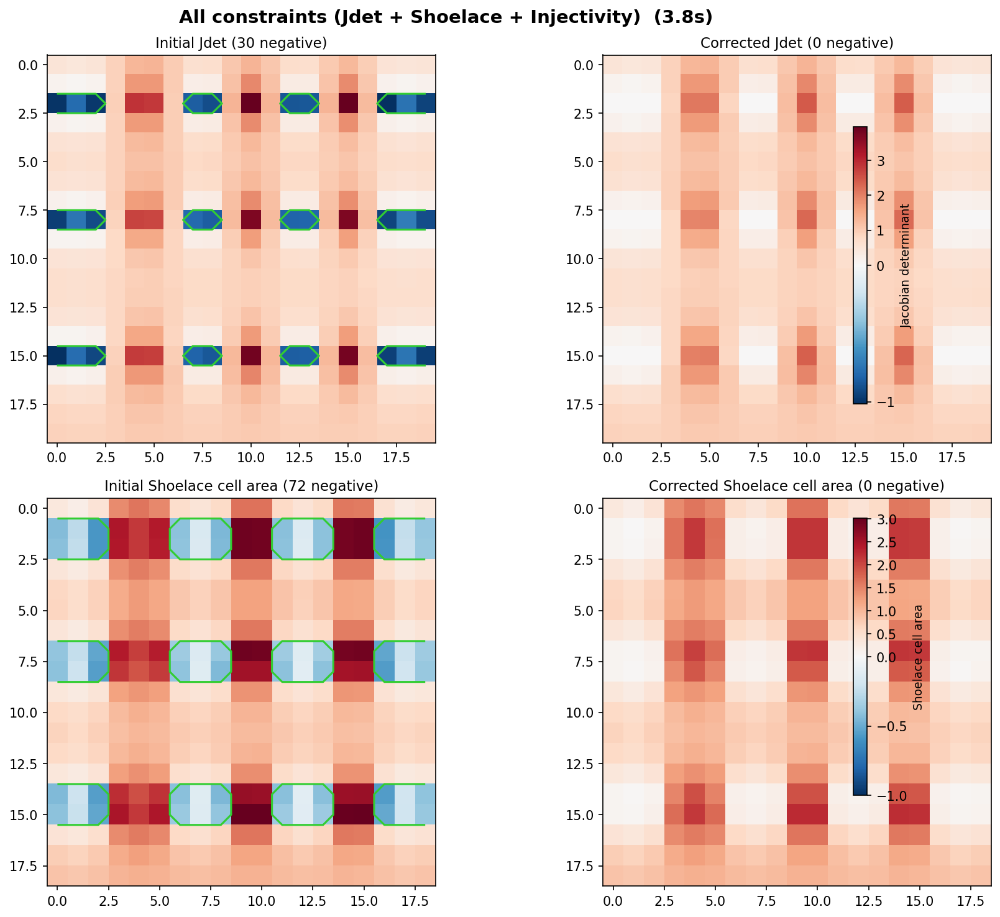

## Convergence

Each correction method has different convergence properties. Understanding _why_ they converge (or fail to) matters for choosing the right method and diagnosing stalled corrections.

### Full-Grid SLSQP: Strongest guarantees

The full-grid formulation is a standard nonlinear constrained optimization problem:

$$\min_\phi \|\phi - \phi_{\text{init}}\|_2 \quad \text{s.t.} \quad J_{\det}(\phi) \geq \tau$$

SLSQP (Sequential Least Squares Programming) solves this by iteratively building a local quadratic model of the objective and linear models of the constraints, then solving the resulting quadratic program (QP) at each step. It is a well-studied algorithm with convergence theory:

- **Local convergence** is guaranteed when the objective is smooth, the constraints are smooth, and a _constraint qualification_ holds (roughly: the constraint gradients are not degenerate at the solution). All three hold here — the L2 norm is smooth, the Jacobian determinant is a smooth polynomial function of the displacement components, and constraint qualification holds generically (it would only fail in contrived degenerate configurations).
- **Global convergence** (convergence from any starting point) is not formally guaranteed by SLSQP. However, because our starting point $\phi_{\text{init}}$ is the original deformation field — which is already a _good_ field everywhere except the folding regions — the optimizer starts very close to a feasible solution and rarely struggles.

**When it can fail:** On very large grids, the number of optimization variables ($2 \times H \times W$) and constraints ($\approx H \times W$) becomes enormous. SLSQP must factor and solve a dense QP at each iteration, which scales poorly. It may hit the iteration limit (`max_minimize_iter = 1000`) before fully converging. The result will still be improved (fewer folds than the input) but may not be completely clean.

**Why it works in practice:** The objective (L2 distance) has a single global minimum — it is convex. The constraint set (all fields with $J_{\det} \geq \tau$) is not convex in general (the Jacobian determinant is a polynomial, not a linear function of $\phi$), so the overall problem is non-convex. But in practice, the feasible region near $\phi_{\text{init}}$ is well-behaved because only small adjustments are needed. SLSQP finds the nearby feasible point efficiently.

### Iterative SLSQP: Convergence via monotone progress

The iterative method does not solve the global problem in one shot. Instead, it makes a sequence of local corrections, each solving a small windowed sub-problem. Convergence of the _overall_ process relies on three properties:

**1. Each step is non-worsening.** The SLSQP sub-problem minimizes $\|\phi_{\text{window}} - \phi_{\text{init, window}}\|_2$ subject to $J_{\det} \geq \tau$ inside the window. The initial state of the window is always a feasible starting point for the L2 objective (it is just $\phi$ itself — which is the identity mapping at iteration 0 or the result of prior corrections). If SLSQP finds a better solution, it reduces the negative-Jdet count. If it fails to improve, the window grows and it tries again with more room to maneuver. The field is never made worse.

**2. The window growth guarantees eventual coverage.** If a small window cannot resolve a fold (because the correction would need to "borrow" displacement from pixels outside the window), the algorithm grows the window by 2 pixels in each dimension and retries. This growth continues up to the full grid size. At that point it becomes the full-grid SLSQP problem, which has the same convergence properties described above. So the iterative method has the full-grid method as an ultimate fallback — it will never get permanently stuck at a window size.

**3. The worst-first strategy ensures progress.** Each outer iteration targets the pixel with the _lowest_ Jacobian determinant. Fixing the worst pixel first ensures the most severe folds are addressed early. Once a fold is fixed, it stays fixed as long as later corrections don't disturb it — which the frozen-edge constraints are specifically designed to prevent.

**When it can fail:** The iterative method is not globally optimal. Each windowed correction is locally optimal for that window, but separately-corrected overlapping regions can interfere. The L2 error of the iterative result is typically slightly higher than the full-grid result. In rare cases with dense, entangled folding regions that span most of the grid, the iterative approach may require many window-growth cycles before converging — eventually degenerating to full-grid SLSQP speed.

**Frozen edges and local containment.** Freezing the boundary of each window is what makes the iterative approach work at all. Without it, fixing one fold could create a new one right outside the window, leading to an infinite chase. By keeping edges fixed, each correction is guaranteed to not introduce new folds in the surrounding field. The +1 pixel positive-border expansion ensures the frozen edges themselves satisfy the constraint, so the sub-problem is always feasible.

### Hybrid Parallel: Same guarantees, with escalation

The parallel variant processes multiple non-overlapping windows per iteration. Since the windows don't overlap, the corrections are independent and the same non-worsening argument applies.

**Escalation handles stalls.** If a parallel batch produces no improvement (the negative-Jdet count doesn't decrease), the algorithm forces all future windows to be at least 2 pixels larger. This escalation continues until windows are large enough to resolve the folds. In the limit, windows grow to full-grid size and the algorithm degrades to serial full-grid SLSQP — slow, but guaranteed to converge.

**Non-overlapping batching is conservative.** The greedy batch selection only picks windows with no spatial overlap. This means corrections in one window cannot affect pixels in another window within the same batch. The tradeoff: smaller batches than theoretically possible (some non-interacting windows might be skipped if they geometrically overlap), but perfect independence.

### Heuristic (NMVF): No convergence guarantee

The heuristic replaces each negative-Jdet neighborhood with its local mean. This has **no formal convergence guarantee**:

- **It can oscillate.** Smoothing a 3×3 patch around one negative pixel may push a neighbor's Jacobian determinant negative, which then gets smoothed in the next iteration, potentially recreating the original fold.
- **It can stall.** If the folding pattern is symmetric, the mean of the neighborhood may be identical to the current displacement, producing no change.
- **It does converge in practice** for most inputs, because local averaging acts as diffusion — it smooths out sharp displacement gradients that cause folds. Each iteration reduces the magnitude of local displacement differences, and eventually the field becomes smooth enough that no Jacobian determinant is negative.

**Why use it despite weaker guarantees?** Speed. The heuristic requires no optimization solver — just array averaging — so each iteration is orders of magnitude faster than an SLSQP step. For fields with mild, sparse folding, it converges in a few iterations and produces an acceptable (if not minimal) correction.

### Summary

| Method | Convergence guarantee | Failure mode | Recovery mechanism |
|--------|----------------------|-------------|--------------------|
| Full-Grid SLSQP | Local (SLSQP theory) | Iteration limit on large grids | Increase `max_minimize_iter` |
| Iterative SLSQP | Monotone progress + full-grid fallback | Dense entangled folds → slow | Window growth → full-grid |
| Parallel SLSQP | Same as iterative + escalation | Stalled batches | Force window growth globally |
| Heuristic (NMVF) | None (empirical) | Oscillation, stalling | Increase `max_iter`, accept higher L2 |

### Constraint convergence

The optimizer enforces constraints at every SLSQP iteration, but including more constraints changes the shape of the feasible region and therefore affects how (and whether) the algorithm converges.

#### Jacobian determinant: the primary constraint

The core constraint $J_{\det} \geq \tau$ defines a _nonlinear_ feasible region. The Jacobian determinant is a smooth polynomial of the displacement components (a product of first-order partial derivatives), so its gradient is well-defined everywhere and SLSQP can linearize it reliably.

**Feasibility near the start.** The initial field $\phi_{\text{init}}$ is almost entirely feasible — only a handful of pixels violate $J_{\det} \geq \tau$. This means the optimizer starts right at (or very near) the boundary of the feasible set. SLSQP's active-set strategy works well in this regime: it identifies the few active constraints (the pixels that are just barely at $\tau$) and adjusts those, while the vast majority of constraints are inactive and free.

**Constraint qualification.** SLSQP requires that the gradients of the active constraints are linearly independent at the solution (the _Linear Independence Constraint Qualification_, or LICQ). For the Jacobian determinant, each constraint is a polynomial over different combinations of neighboring pixels, so their gradients point in different directions. LICQ fails only in extremely degenerate configurations (e.g., a perfectly uniform displacement field where all partial derivatives are identical), which do not arise in practice.

#### Frozen edges: always satisfiable, zero cost

The frozen-edge constraint $\phi_k = \phi_k^{\text{init}}$ for boundary pixels is a linear equality constraint. It simply removes degrees of freedom from the problem — the optimizer never needs to iterate to satisfy it. The equality is enforced exactly at every SLSQP step via the QP sub-problem.

**Impact on convergence:** Reducing the number of free variables makes the optimization _easier_, not harder. The QP has fewer unknowns, and the constraint Jacobian has fewer columns. The tradeoff is a smaller feasible region (less room to maneuver), which can require a larger window to find a correction. But the frozen edges themselves never cause convergence failure.

**Compatibility with the Jacobian constraint.** The +1 pixel positive-border expansion (described in the [Iterative SLSQP method](#iterative-slsqp-near-optimal-l2-much-faster)) guarantees that the frozen edge pixels already satisfy $J_{\det} \geq \tau$. So the frozen edges and the Jacobian constraint never conflict — they are always simultaneously satisfiable at the starting point. This is important because SLSQP can fail if the initial point is infeasible for _all_ constraints simultaneously.

#### Shoelace area: tighter but compatible

Enabling `enforce_shoelace=True` adds a second `NonlinearConstraint` requiring all quad-cell signed areas to exceed $\tau$. This _tightens_ the feasible region — every field that satisfies the shoelace constraint also has positive Jacobian determinants (positive cell areas imply no local folding), but the converse is not always true. Some fields with positive Jacobian at all four corners of a cell can still have a self-intersecting ("bowtie") quad, which the shoelace constraint catches.

**How it affects convergence:**

- **The feasible region shrinks.** There are fewer deformation fields that satisfy both constraints simultaneously. This means the optimizer may need more iterations or larger windows to find a correction, because the "room to adjust" is smaller.
- **The constraint functions are smooth.** The shoelace area is a polynomial of the same form as the Jacobian determinant (products of deformed coordinates). Its gradient exists everywhere and is well-conditioned. SLSQP linearizes it just as easily.
- **Constraint interactions.** With two nonlinear constraints active at the same pixel neighborhood, SLSQP must satisfy both simultaneously. It can happen that the Jacobian-only solution places a quad right at the edge of self-intersection — adding the shoelace constraint pushes the optimizer to a slightly different (slightly higher L2 error) solution. This is a genuine change in the optimum, not a convergence failure.
- **LICQ still holds.** The shoelace gradient involves different combinations of vertex positions than the Jacobian gradient (cell-level vs. pixel-level central differences). As long as the two constraints don't become redundant (which they generically don't), their combined constraint Jacobian has full rank and SLSQP's convergence theory applies.

**In the quality map,** when shoelace is enabled, the per-pixel quality metric is the element-wise minimum of the Jacobian determinant and the worst shoelace area touching each pixel. This ensures that the worst-first targeting in the iterative methods correctly identifies violations of _either_ constraint, not just the Jacobian.

#### Injectivity (monotonicity): the strictest constraint

Enabling `enforce_injectivity=True` adds four monotonicity conditions: horizontal (h), vertical (v), and two anti-diagonal (d1, d2) conditions per quad cell. All are linear functions of the displacement components.

$$h:\; 1 + u_x[i,j+1] - u_x[i,j] \geq \tau_{\text{inj}}$$
$$v:\; 1 + u_y[i+1,j] - u_y[i,j] \geq \tau_{\text{inj}}$$
$$d_1:\; 1 + u_x[r,c+1] - u_x[r+1,c] \geq \tau_{\text{inj}} \quad \text{(TR.x > BL.x)}$$
$$d_2:\; 1 + u_y[r+1,c] - u_y[r,c+1] \geq \tau_{\text{inj}} \quad \text{(BL.y > TR.y)}$$

The threshold $\tau_{\text{inj}}$ is set via `injectivity_threshold` (separate from the Jdet `threshold`). This is the tightest constraint available — every globally injective field satisfies all four, but not vice versa. The feasible region is the smallest of all constraint configurations.

**How it affects convergence:**

- **All four conditions are linear.** Their gradients are constant sparse vectors (exactly 2 nonzero entries per constraint row). The constraint Jacobian is a constant matrix — SLSQP never needs to re-linearize it, and it is always well-conditioned. This is the most solver-friendly of the three constraint types.
- **Boundary-adjacent coverage.** The d1/d2 constraints are enforced even at cells that touch the frozen sub-window boundary, as long as at least one vertex of the cell is free. This closes the interface gap where independently corrected sub-windows meet. Only the two corner cells with both vertices frozen are excluded per sub-window.
- **`injectivity_threshold` governs the effective feasible region.** With `τ_inj = 0.01`, the vertex-separation margin is negligible and distant rows can still converge toward each other under large shear. With `τ_inj = 0.3`, each pair of anti-diagonal vertices must be at least 0.3 units apart in deformed space. This chains across the grid and prevents global overlap. The cost is a tighter feasible region — fields with extreme local compression may require larger windows or higher L2 error to satisfy.
- **Infeasibility risk.** On very small windows with frozen edges, no interior rearrangement may simultaneously satisfy monotonicity in all four directions. The iterative algorithm handles this by growing the window (more free pixels) or falling back to the full-grid optimizer. Raising `injectivity_threshold` increases this risk slightly.
- **Linear interaction with frozen edges.** Since both the monotonicity and frozen-edge constraints are linear, their combined feasible set is a polyhedron (intersection of half-spaces). SLSQP handles polyhedra exactly in the QP sub-problem. The nonlinear Jdet and shoelace constraints then carve out a nonlinear sub-region within that polyhedron — a layered structure that SLSQP handles efficiently.

**In the quality map,** all four monotonicity diffs (h, v, d1, d2) are spread to per-pixel values (each pixel receives the minimum diff from all cells it participates in as a vertex), then element-wise minimized with the Jacobian and shoelace values. This unified metric ensures worst-first targeting captures every violation type simultaneously.

#### Combined constraints: summary

| Constraint | Type | Feasible region | Impact on convergence | Failure mode |
|-----------|------|----------------|----------------------|-------------|
| Jacobian $\geq \tau$ | Nonlinear | Largest (no local folds) | Mild — smooth, well-conditioned | Iteration limit on very large grids |
| Frozen edges | Linear equality | Removes DOFs | Helps — smaller QP | None (always exact) |
| + Shoelace $\geq \tau$ | Nonlinear | Tighter (no bowtie cells) | Moderate — may need more iterations | Rare, only at bowtie-only violations |
| + Injectivity h/v $\geq \tau_{\text{inj}}$ | Linear | Stricter (row/col ordering) | More iterations or larger windows | Infeasible small windows → window growth |
| + Injectivity d1/d2 $\geq \tau_{\text{inj}}$ | Linear | Tightest (cell convexity) | Depends on `injectivity_threshold` | Large $\tau_{\text{inj}}$ → tighter, may need larger windows |
| All three + $\tau_{\text{inj}}=0.3$ | Mixed | Smallest | Highest L2, slowest, most robust | Infeasible sub-windows → full-grid fallback |

When all constraints are active, the optimizer converges to the minimum-L2 field satisfying every condition simultaneously. Each added constraint shrinks the feasible region, so the result is always at least as far from $\phi_{\text{init}}$ (higher L2 error) but geometrically more trustworthy. The `injectivity_threshold` parameter directly trades off L2 error against global overlap prevention: lower values (close to 0) permit tighter cell packing, higher values (up to ~0.3) prevent distant rows from pinching together at the cost of larger displacement corrections.

## 3D Extension

The 3D extension in `dvfopt/core/solver3d.py` + `dvfopt/core/iterative3d.py` generalizes all 2D operations:

| Aspect | 2D | 3D |
|--------|----|----|
| Deformation shape | $(3, 1, H, W)$ | $(3, D, H, W)$ |
| Jacobian matrix | $2 \times 2$ | $3 \times 3$ determinant via cofactor expansion |
| Connected component | 8-connectivity | 26-connectivity (3×3×3 structuring element) |
| Frozen boundary | 4 edges | 6 faces of sub-volume |
| Phi packing | $[\text{dx}, \text{dy}]$ | $[\text{dx}, \text{dy}, \text{dz}]$ |
| Constraint indices | 2 per pixel | 3 per voxel |

The iterative algorithm is structurally identical — find worst voxel, compute 3D bounding box, extract sub-volume, freeze 6 faces, run SLSQP, write back.

## Data Conventions

- **Deformation fields:** `(3, 1, H, W)` NumPy arrays with channels `[dz, dy, dx]`. For 2D work the z-slice dimension is 1.
- **Pull-back convention:** Each displacement vector points from a fixed-image pixel to its source in the moving image: $\text{fixed} + \text{displacement} = \text{moving}$.
- **Coordinate ordering:** `[z, y, x]` everywhere. Correspondences are `(N, 3)` arrays.
- **SimpleITK interop:** Arrays are transposed `(3,1,H,W)` → `(1,H,W,3)` and axis-reordered `[2,1,0]` (zyx → xyz) before calling SimpleITK.
- **Phi flattening:** During optimization, the displacement field is flattened as `phi[:len(phi)//2]` = dy, `phi[len(phi)//2:]` = dx (2D) or `[dx, dy, dz]` concatenated (3D).
- **Plotting:** `meshgrid` with `indexing='xy'`; y-axis inverted to match image convention.

## Project Structure

```
├── dvfopt/                         # Installable Python package
│   ├── core/                       # Optimization algorithms
│   │   ├── objective.py            # L2 objective function
│   │   ├── constraints.py          # Jacobian, shoelace, injectivity constraints
│   │   ├── spatial.py              # Window selection, bounding box, edge logic
│   │   ├── solver.py               # Single-window SLSQP solver
│   │   ├── iterative.py            # Serial iterative correction (2D)
│   │   ├── parallel.py             # Hybrid parallel correction (2D)
│   │   ├── solver3d.py             # 3D solver helpers
│   │   └── iterative3d.py          # 3D iterative correction
│   ├── jacobian/                   # Jacobian determinant computation
│   │   ├── numpy_jdet.py           # Pure-numpy 2D/3D Jacobian
│   │   ├── sitk_jdet.py            # SimpleITK wrapper
│   │   ├── shoelace.py             # Shoelace (geometric quad area) constraint
│   │   └── monotonicity.py         # Injectivity/monotonicity constraint
│   ├── dvf/                        # Deformation field utilities
│   │   ├── generation.py           # Random DVF generation (2D/3D)
│   │   └── scaling.py              # Bicubic rescaling (2D/3D)
│   ├── laplacian/                  # Laplacian interpolation
│   │   ├── matrix.py               # Sparse matrix construction
│   │   └── solver.py               # LGMRES solver, end-to-end pipeline
│   ├── viz/                        # Visualization (matplotlib)
│   │   ├── snapshots.py            # Per-iteration heatmaps
│   │   ├── fields.py               # Deformation field plots
│   │   ├── grids.py                # Deformed grid visualization
│   │   ├── closeups.py             # Checkerboard & neighborhood views
│   │   └── pipeline.py             # End-to-end plotting pipeline
│   ├── io/                         # I/O utilities
│   │   └── nifti.py                # NIfTI loading via nibabel
│   ├── utils/                      # Miscellaneous helpers
│   │   ├── checkerboard.py         # Checkerboard image generation
│   │   ├── correspondences.py      # Point correspondence utilities
│   │   └── transform.py            # Affine/deformation field application
│
├── test_cases/                     # Test case registry and data loaders
│
├── notebooks/                      # Jupyter notebooks
│   ├── slsqp-iterative-refactored.ipynb    # Iterative SLSQP — primary
│   ├── heuristic-neg-jacobian.ipynb        # Heuristic (NMVF) correction
│   ├── slsqp-3d.ipynb                      # 3D correction tests
│   ├── run-parallel-corrections.ipynb      # Batch parallel corrections
│   ├── generate_test_cases.ipynb           # Generate and save test data
│   ├── test-shoelace-constraint.ipynb      # Shoelace constraint tests
│   └── test-injectivity-constraint.ipynb   # Injectivity constraint tests
│
├── benchmarks/                     # Benchmark notebooks
│   ├── benchmark-serial-vs-parallel.ipynb
│   ├── voxelmorph-registration.ipynb
│   └── correct-ants-warps.ipynb
│
├── data/                           # Test case data (.npy files)
├── output/                         # Correction output results
├── archive/                        # Historical notebook iterations
└── legacy_code/                    # Previous notebook versions
```

### Module Reference

| Sub-package | Purpose |
|-------------|---------|
| `dvfopt.core` | Objective/constraint functions, `iterative_serial` (serial), `iterative_parallel` (hybrid), `iterative_3d`, window selection, SLSQP solver |
| `dvfopt.jacobian` | Pure-numpy 2D/3D Jacobian (`jacobian_det2D`, `jacobian_det3D`), SimpleITK wrapper, shoelace constraint, injectivity constraint |
| `dvfopt.dvf` | `generate_random_dvf`, `scale_dvf` (2D/3D) |
| `dvfopt.viz` | `plot_deformations` (2×2 panel), `plot_grid_before_after` (colored quad grids), `plot_step_snapshot` (per-iteration heatmap) |
| `test_cases` | `SYNTHETIC_CASES` (8 correspondence-based), `RANDOM_DVF_CASES` (4 random), `REAL_DATA_SLICES` (8 real-data configs) — separate package |
| `dvfopt.utils` | Checkerboard generation |
| `laplacian` | Sparse 1D/2D/3D Laplacian matrix with Dirichlet BCs, CG/LGMRES solvers, contour correspondence matching, slice-to-slice registration pipeline (separate package) |

## Test Cases

### Synthetic (Correspondence-Based)

Defined in the `test_cases/` package (for example, `test_cases/_cases.py`) as `SYNTHETIC_CASES`. Deformation fields constructed by solving a Laplacian system with Dirichlet boundary conditions at correspondence points:

$$\nabla^2 u = 0 \quad \text{(interior)}, \qquad u(\mathbf{p}_i) = \mathbf{m}_i - \mathbf{f}_i \quad \text{(correspondences)}$$

Types include crossing vectors, opposing vectors, and edge-distributed points on 10×10, 20×20, and 20×40 grids.

| Case | Grid | Type | Preview |
|------|------|------|---------|
| `01a_10x10_crossing` | 10×10 | Crossing | 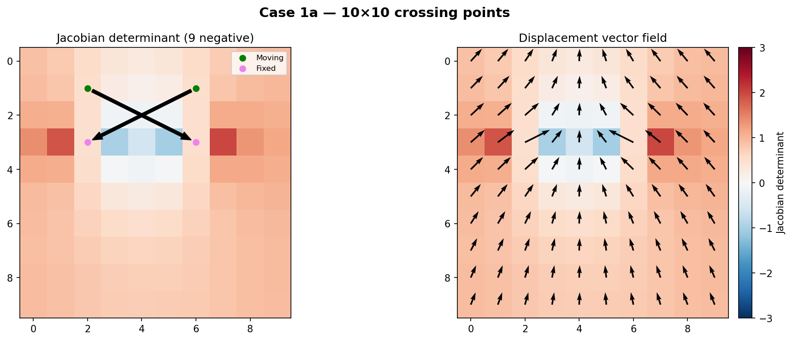 |
| `01b_10x10_opposite` | 10×10 | Opposite | 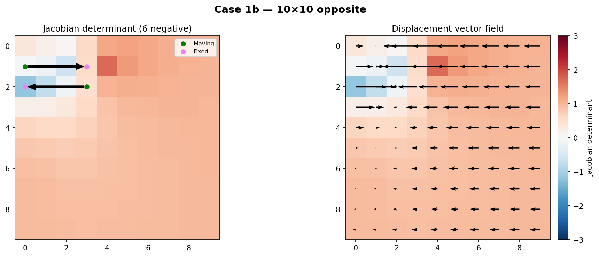 |
| `01c_20x40_edges` | 20×40 | Edge-distributed | 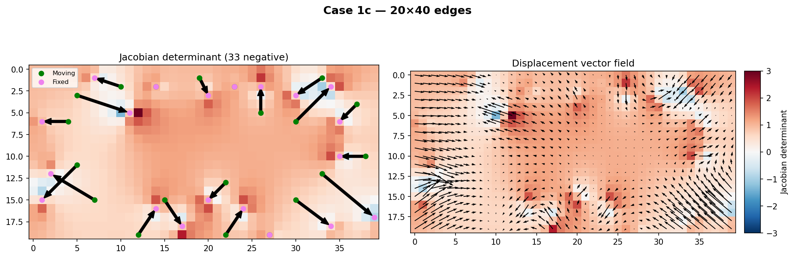 |
| `01d_20x40_crossing` | 20×40 | Crossing | 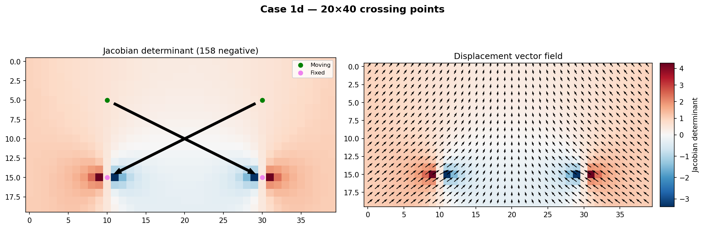 |
| `03a_10x10_opposite` | 10×10 | Opposites (5 pts) | 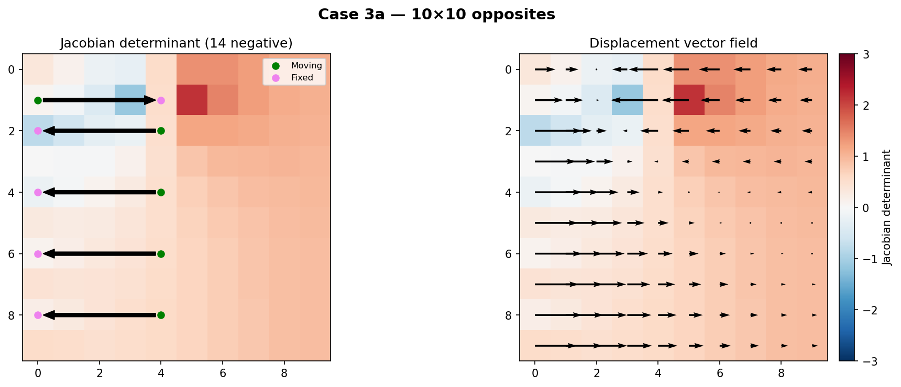 |
| `03b_10x10_crossing` | 10×10 | Crossing (8 pts) | 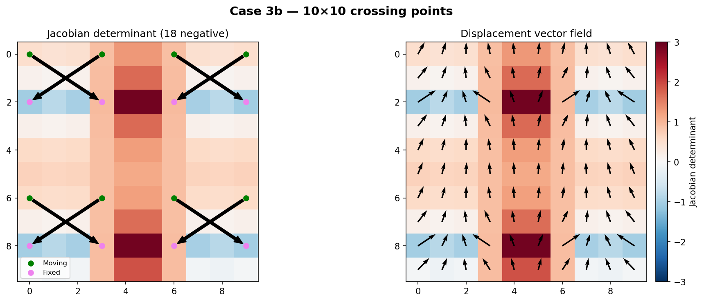 |
| `03c_20x20_opposite` | 20×20 | Opposites (10 pts) | 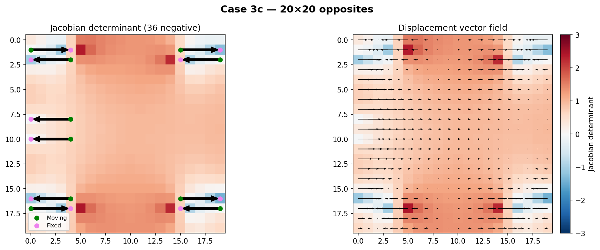 |
| `03d_20x20_crossing` | 20×20 | Crossing (24 pts) | 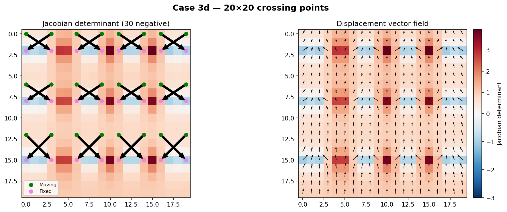 |

Each image shows the Jacobian determinant heatmap (left, blue = negative/folding, red = positive) and displacement vector field (right). Black arrows on the left panel show correspondence vectors from moving (green) to fixed (violet) points.

### Random DVFs

Generated via `generate_random_dvf(shape, max_magnitude)` — uniform random displacements optionally rescaled via bicubic interpolation (`scale_dvf`).

| Case | Grid | Description | Preview |
|------|------|-------------|---------|
| `01e_20x20_random_spirals` | 20×20 | 5×5 random upscaled to 20×20 | 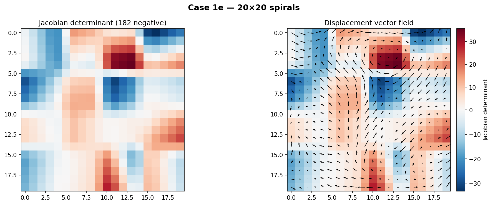 |
| `01f_20x20_random_seed_42` | 20×20 | Native 20×20 random (mag 3.0) | 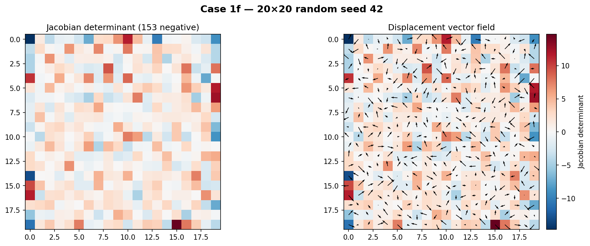 |
| `03a_10x10_random_seed_42` | 10×10 | 5×5 random upscaled to 10×10 | 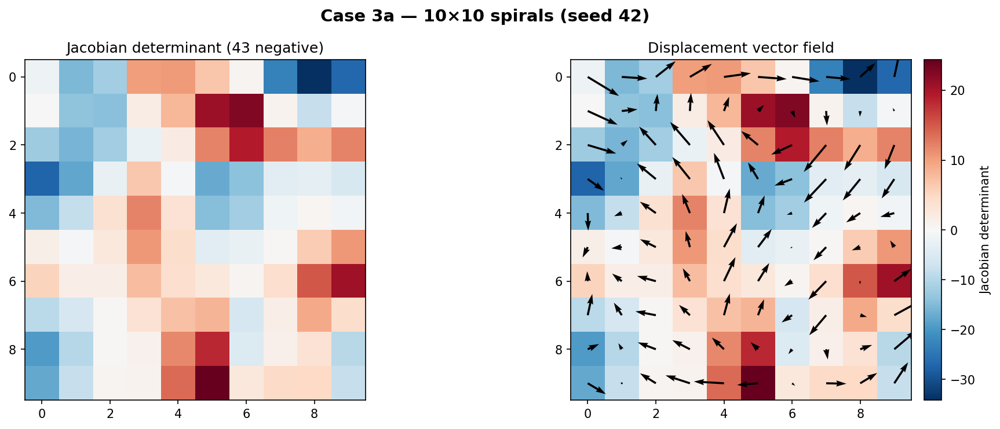 |
| `03c_20x20_random_seed_42` | 20×20 | 5×5 random upscaled to 20×20 | 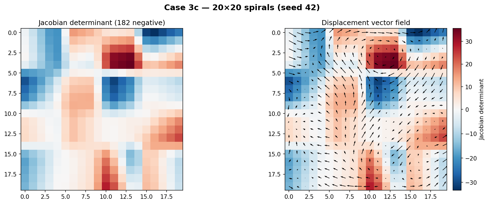 |

Upscaled cases (5×5 → larger) produce smooth spiral-like patterns via bicubic interpolation, while native-resolution cases have sharper, more localized folds.

### Real Data

Axial slices from ANTs registration warps (`.npy` files), available at full resolution (320×456) and downscaled (64×91). Real data files are not included in the repository — see `test_cases/_cases.py` for the `REAL_DATA_SLICES` configuration.

## Installation

```bash
python -m venv .venv
source .venv/bin/activate  # Linux/Mac
# or: .venv\Scripts\activate  # Windows

pip install -r requirements.txt
pip install -e .  # Install dvfopt package in editable mode
```

### Dependencies

`numpy`, `scipy` (SLSQP optimizer, sparse LGMRES), `SimpleITK` (Jacobian computation), `nibabel` (NIfTI I/O), `matplotlib` (visualization).

## Usage

### Iterative SLSQP (Recommended)

```python
from dvfopt import iterative_parallel, jacobian_det2D

# deformation: (3, 1, H, W) numpy array with channels [dz, dy, dx]
phi_corrected = iterative_parallel(
    deformation,
    method="SLSQP",
    verbose=1,
    max_workers=4,               # parallel workers (None = auto)
    enforce_shoelace=False,      # optional shoelace constraint
    enforce_injectivity=False,   # optional injectivity constraint
)

# Verify
jdet = jacobian_det2D(phi_corrected)
assert jdet.min() > 0
```

### Heuristic (Fast)

```python
# See heuristic-neg-jacobian.ipynb
phi_corrected = heuristic_negative_jacobian_correction(deformation, max_iter=1000)
```

### 3D Volumes

```python
from dvfopt import iterative_3d, jacobian_det3D

# deformation: (3, D, H, W) numpy array
phi_corrected = iterative_3d(deformation, method="SLSQP", verbose=1)
```

### Output Format

Corrections save to a directory containing:

| File | Contents |
|------|----------|
| `results.txt` | Settings, runtime, L2 error, neg-Jdet summary |
| `phi.npy` | Corrected displacement field |
| `error_list_l2.npy` | Per-iteration L2 error |
| `num_neg_jac.npy` | Per-iteration negative-Jdet count |
| `min_jdet_list.npy` | Per-iteration minimum Jdet |
| `iter_times.npy` | Per-iteration wall time |
| `window_counts.csv` | Window size histogram (iterative only) |

